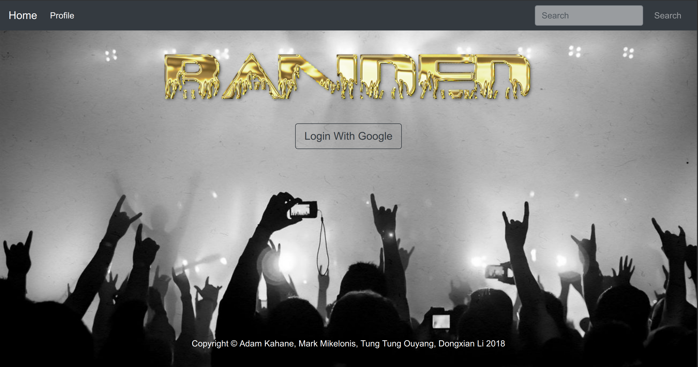
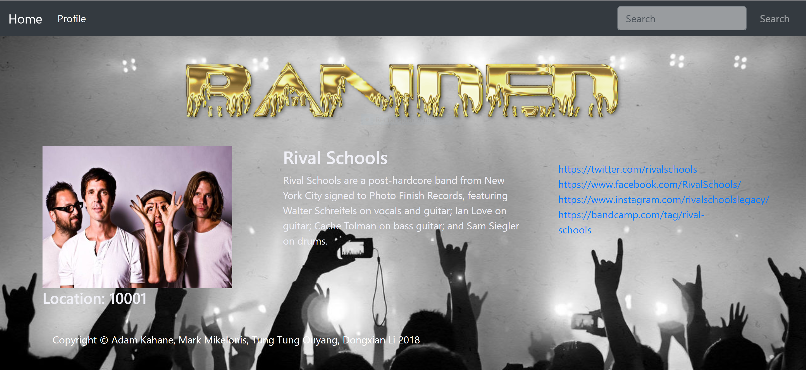
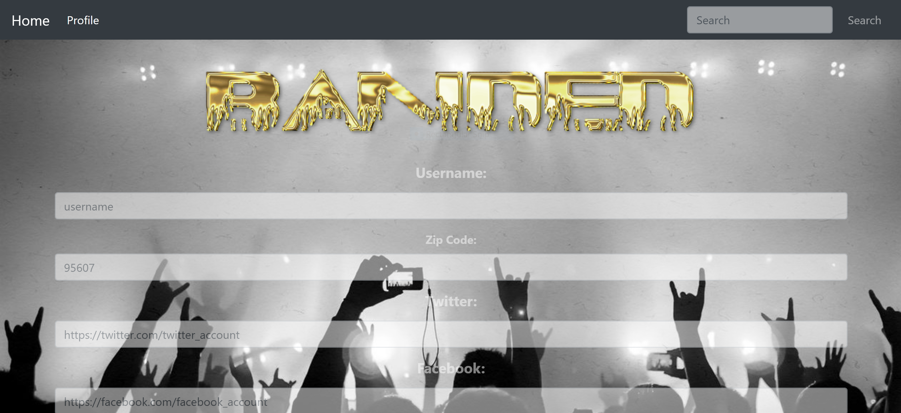

# BANDED
A Place for bands to bring fans into their lives.
Our motivation was to connect bands and their fans, by allowing artists to stream live video of their creative processes or impromptu performances directly to their fans. This is the place for bands to show their stories of behind the scenes.
This would strengthen the sense of community for the fans as well as provide the artist with a chance to promote future album releases or live shows.

## LINK
[BANDED](https://banded.herokuapp.com/ "BANDED")

## INSTRUCTIONS
  * Visit link above.
  * Click the login with Google button to link your Google account to BANDED. This will ask for access to your YouTube account as well as     your Google Calander.
  
  
  
  * If the user is already a member, they will be taken to their profile page.
  
  
  
  * IF the user is not already in the BANDED database, they will be brought to the "create profile" page.
    * The user will be asked whether they are a fan or a band.
    
    
    
    * Depending on the choice, they will be given a form to fill out and create a BANDED profile.
    
   

## BANDS
  * Create a live video stream.
    * This will create a YouTube live broadcast event for the upcoming video stream
    * Each fan who is listening to this band will be notified of the upcoming stream.
  * Stream a live band practice, song writing session, or intimate "livingroom show" to your fans.
